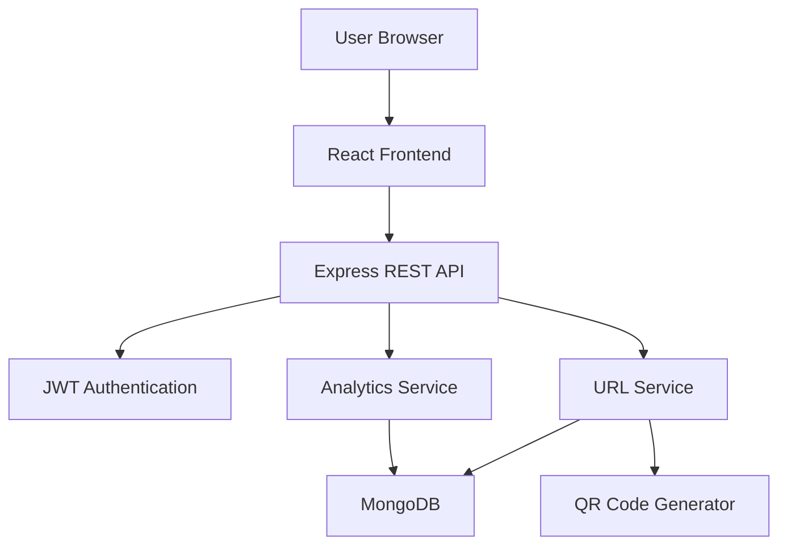

  <div align="center">

# 🔗 ShortLink

### Intelligent URL Management Platform for Creating, Tracking, and Managing Short Links

A production-inspired SaaS platform that enables users to create branded short links, generate QR codes, monitor link performance, and manage URLs through a secure analytics dashboard.


</div>

---

# 🌐 Live Demonstration

### 🎥 Loom Walkthrough
https://www.loom.com/share/8755cb0a0c9a4604b8f7bfca9465c0be

### 📹 YouTube Demo
https://youtu.be/Pp5VVnVVRM8?si=AGG2BwVDE1Zpla7K

---

# 📖 Overview

Managing and sharing long URLs is inconvenient and provides little insight into user engagement.

ShortLink solves this problem by providing a modern URL management platform where users can:

- Create shortened URLs
- Generate custom aliases
- Monitor click analytics
- Generate QR codes
- Manage all links from a centralized dashboard

The platform is designed using production-inspired engineering practices including authentication, analytics tracking, API security, and responsive UI design.

---

# ✨ Features

## 🔐 Authentication & Security

- User Registration and Login
- JWT Authentication
- Protected Routes
- Password Hashing using bcrypt
- Role-based API Protection
- Rate Limiting
- Security Headers with Helmet

---

## 🔗 URL Management

- Create Short URLs
- Automatic Short Code Generation
- Custom Aliases
- Copy-to-Clipboard
- URL Validation
- Expiry Date Support
- Bulk URL Creation

---

## 📊 Analytics Dashboard

- Total Click Count
- Recent Visits
- Last Visited Information
- Device Tracking
- Visitor Statistics
- Search and Filter Links

---

## 📱 QR Code Features

- Generate QR Codes
- Download QR Codes
- Mobile Scanning Support
- Instant Redirection

---

# 🏗 System Architecture



---

# 🛠 Tech Stack

| Layer | Technology |
|-------|-------------|
| Frontend | React.js, Vite, JavaScript |
| Backend | Node.js, Express.js |
| Database | MongoDB, Mongoose |
| Authentication | JWT, bcrypt |
| Security | Helmet, Rate Limiting |
| Utilities | Axios, QRCode |

---

# 📂 Project Structure

```text
ShortLink/
│
├── frontend/
│   ├── public/
│   ├── src/
│   │   ├── components/
│   │   ├── pages/
│   │   ├── hooks/
│   │   ├── services/
│   │   ├── contexts/
│   │   └── utils/
│   │
│   └── package.json
│
├── backend/
│   ├── src/
│   │   ├── config/
│   │   ├── middleware/
│   │   ├── models/
│   │   ├── controllers/
│   │   ├── routes/
│   │   ├── services/
│   │   └── utils/
│   │
│   └── package.json
│
├── docs/
│   ├── screenshots/
│   └── architecture/
│
├── .github/
│   └── workflows/
│
├── README.md
├── .env.example
└── LICENSE
```

---

# 🗄 Database Design

## Users

```js
{
  email,
  passwordHash,
  createdAt
}
```

## URLs

```js
{
  originalUrl,
  shortCode,
  customAlias,
  userId,
  totalClicks,
  expiresAt,
  createdAt
}
```

## Click Analytics

```js
{
  shortCode,
  ipAddress,
  device,
  country,
  clickedAt
}
```

---

# 🔌 REST APIs

## Authentication

```http
POST /api/auth/register
POST /api/auth/login
```

## URLs

```http
POST /api/urls
GET /api/urls
DELETE /api/urls/:id
```

## Analytics

```http
GET /api/analytics/:shortCode
```

## Redirect

```http
GET /:shortCode
```

---

# ⚙️ Installation

## Clone Repository

```bash
git clone https://github.com/Dharneesh0912/ShortLink.git
cd ShortLink
```

---

## Backend Setup

```bash
cd backend
npm install
npm run dev
```

---

## Frontend Setup

```bash
cd frontend
npm install
npm run dev
```

---

# 🔐 Environment Variables

```env
PORT=5000

MONGODB_URI=

JWT_SECRET=

BASE_URL=http://localhost:5000
```

---

# 📸 Screenshots

### Login Page
(Add Screenshot)

### Dashboard
(Add Screenshot)

### URL Creation
(Add Screenshot)

### Analytics
(Add Screenshot)

### QR Code Generation
(Add Screenshot)

---

# 🔒 Security Features

✅ Password Hashing using bcrypt

✅ JWT Authentication

✅ Input Validation

✅ Protected Routes

✅ Rate Limiting

✅ Helmet Middleware

✅ Environment Variables

---

# 🧪 Testing Checklist

- User Registration
- User Login
- Create Short URL
- Custom Alias Creation
- Redirect Functionality
- Analytics Tracking
- QR Code Generation
- URL Deletion
- Error Handling

---

# 📈 Future Enhancements

- Custom Domains
- Team Workspaces
- Advanced Analytics Dashboard
- Link Categorization
- Export Reports
- Public API Access
- Redis Caching
- Geo-location Analytics
- Docker Deployment
- CI/CD Integration

---

# 🎯 Learning Outcomes

- Full Stack Development
- Authentication & Authorization
- REST API Design
- Database Modeling
- Security Best Practices
- Responsive UI Development
- Analytics Tracking Systems
- Software Architecture Design

---

# 🌟 Why This Project Matters

ShortLink demonstrates how a modern SaaS platform can combine authentication, analytics, and secure backend engineering to provide an intelligent URL management solution used by real-world applications.

---

<div align="center">

### Building Intelligent Web Products Through Full Stack Engineering

⭐ If you found this project useful, consider giving it a star.

</div>
